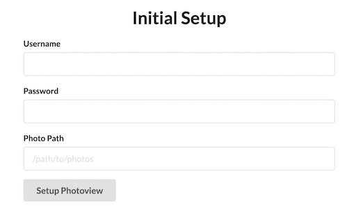

# PhotoView


## Demo site

Visit https://photos.qpqp.dk/

Username: **demo**
Password: **demo**

## Contents

- [Demo site](#demo-site)
- [Aim of the project](#aim-of-the-project)
- [Main features](#main-features)
- [Why yet another self-hosted photo gallery](#why-yet-another-self-hosted-photo-gallery)
- [Getting started - Setup with Docker](#getting-started---setup-with-docker)
- [Setup development environment](#setup-development-environment)

## Aim of the project

The aim of this project is to make a simple and user-friendly photo gallery application,
that is easy to host on a personal server, to easily view the photos located on that server.

## Main features

- **Closely tied to the file system**. The website presents the images found on the local filesystem of the server, directories are mapped to albums.
- **User management**. Each user is created along with a path on the local filesystem, photos within that path can be accessed by that user.
- **Photo sharing**. Photos and albums can easily be shared with other users or publicly with a unique URL.
- **Made for photography**. The website is ment as a way to present photographies, and thus supports **RAW** file formats, and **EXIF** parsing.
- **Performant**. Thumbnails are automatically generated and photos first load when they are visible on the screen. In full screen, thumbnails are displayed until the high resolution image has been fully loaded.

## Why yet another self-hosted photo gallery

There exists a lot of open-source self-hosted photo galleries already. Here are some, just to mention a few.

- [Piwigo](https://github.com/Piwigo/Piwigo)
- [Ownphoto](https://github.com/hooram/ownphotos)
- [Photoprism](https://github.com/photoprism/photoprism)
- [Photato](https://github.com/trebonius0/Photato)

So why another one?
I love taking photos, and I store all of them on my local fileserver.
This is great because I can organize my photos directly on the filesystem so it's easy to move them or take backups. I want to be able to control where and how the photos are stored.

The problem is however that RAW images are extremely tedious to navigate from a fileserver, even over the local network.

My server holds a lot of old family pictures, that I would like my family to have access to as well.
And some of the pictures I would like to easily be able to share with other people without the hassle of them having to make an account first.

Thus I need a solution that can do the following:

- A scan based approach that automatically organises my photos
- Support RAW and EXIF parsing
- Have support for multiple users and ways to share albums and photos also publicly
- Be simple and fast to use

All of the photo galleries can do a lot of what I need, but no single one can do it all.

## Getting started - Setup with Docker

> This section describes how to get PhotoView up and running on your server with Docker.
> Make sure you have Docker and docker-compose installed and running on your server

1. Clone this repository by executing

```bash
$ git clone https://github.com/viktorstrate/photoview
$ cd photoview
```

2. Duplicate `docker-compose.example.yml` and name the new file `docker-compose.yml`
3. Edit `docker-compose.yml`, find the comments starting with `Change This:`, and change the values, to properly match your setup. If you are just testing locally, you don't have to change anything.
4. Start the server by running the following command, inside the `photoview` directory

```bash
$ docker-compose up -d
```

If the endpoint or the port hasn't been changed in the `docker-compose.yml` file, PhotoView can now be accessed at http://localhost:8000

### Initial Setup

If everything is setup correctly, you should be presented with an initial setup wizard, when accessing the website the first time.



Enter a new username and password.

For the photo path, enter the path in the docker container where your photos are located.
This can be set from the `docker-compose.yml` file under `api` -> `volumes`.
The default location is `/photos`

A new admin user will be created, with access to the photos located at the path provided under the initial setup.

The photos will have to be scanned for the photos to show up, you can force a scan, by navigating to `Settings` and clicking on `Scan All`

## Setup development environment

### Local setup

1. Install a local mysql server, and make a new database
2. Rename `/api/example.env` to `.env` and update the `MYSQL_URL` field
3. Rename `/ui/example.env` to `.env`

### [`/api`](./api)

#### Start API server

```bash
cd ./api && go run server/server.go
```

### [`/ui`](./ui)

The above command will start the GraphQL API in the foreground, so in another terminal session start the UI development server:

#### Start UI server

```bash
cd ./ui && npm start
```

The site can now be accessed at [localhost:1234](http://localhost:1234).
And the graphql playground at [localhost:4001](http://localhost:4001)
